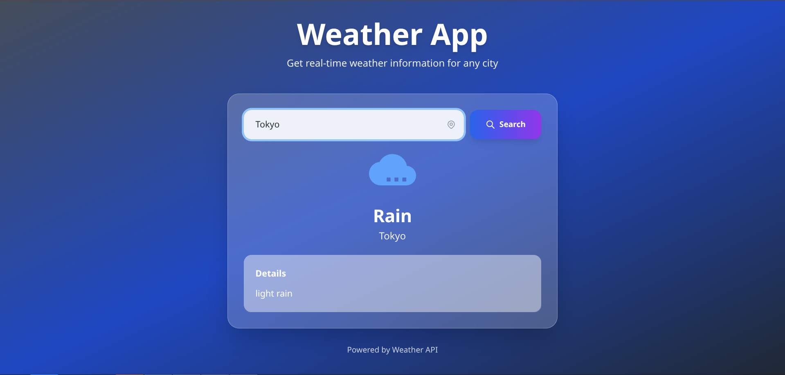

# Weather Application

A modern weather application built with **Spring Boot 4.0.0** and **React** that provides real-time weather information for any city worldwide. Features a beautiful, dynamic UI that changes based on weather conditions.



## 🌟 Features

- 🌤️ Real-time weather data from OpenWeatherMap API
- 🎨 Dynamic gradient backgrounds that adapt to weather conditions
- 📱 Fully responsive design for all devices
- ⚡ Fast and lightweight
- 🎯 Clean and intuitive user interface

## 🛠️ Technologies Used

- **Backend:** Spring Boot 4.0.0, Java 17
- **Frontend:** React 18, Tailwind CSS
- **API:** OpenWeatherMap API
- **Build Tool:** Maven

## 🚀 Quick Start

### Prerequisites

- Java 17 or higher
- Maven 3.6+
- OpenWeatherMap API key (free)

### Installation

1. **Clone the repository**
```bash
   git clone https://github.com/Viny-S/weather-application.git
   cd weather-application
```

2. **Get your API key**
   - Visit [OpenWeatherMap](https://openweathermap.org/api)
   - Sign up for a free account
   - Copy your API key

3. **Create `.env` file**
   
   Copy the example file:
```bash
   cp .env.example .env
```
   
   Or create `.env` manually in the project root:
```properties
   API_KEY=your_actual_api_key_here
```

4. **Run the application**
```bash
   mvn spring-boot:run
```

5. **Open your browser**
```
   http://localhost:8080
```

That's it! 🎉

## 📡 API Endpoints

| Method | Endpoint | Description |
|--------|----------|-------------|
| GET | `/api/weather/{city}` | Get weather information for a specific city |

### Example Response
```json
{
  "weather": "Clear",
  "details": "Clear skies with light winds. Temperature around 22°C."
}
```

## 🎨 Dynamic Backgrounds

The application features dynamic gradient backgrounds that change based on weather conditions:

- ☀️ **Sunny/Clear** → Warm yellow-orange gradient
- 🌧️ **Rainy** → Dark blue-gray gradient
- ☁️ **Cloudy** → Gray gradient
- ❄️ **Snow** → Light blue-white gradient
- ⛈️ **Stormy** → Dark dramatic gradient
- 🌫️ **Fog/Mist** → Light gray-blue gradient

## 📁 Project Structure
```
weather-application/
├── src/
│   ├── main/
│   │   ├── java/
│   │   │   └── com/weather_API/Weather_Application_API/
│   │   │       ├── controller/
│   │   │       ├── service/
│   │   │       ├── entity/
│   │   │       ├── domain/
│   │   │       └── providers/
│   │   └── resources/
│   │       ├── application.properties
│   │       └── static/
│   │           └── index.html
│   └── test/
├── .env.example          ← Template (copy to .env)
├── .gitignore
├── pom.xml
└── README.md
```

## 🔒 Security

- API keys are stored as environment variables
- `.env` file is excluded from version control
- Sensitive data never committed to repository

## 🚢 Deployment

This application can be deployed to platforms like Render, Railway, or Heroku.

**For deployment:**
1. Push your code to GitHub (`.env` is automatically excluded)
2. Set the `API_KEY` environment variable in your hosting platform
3. Deploy!

The application automatically falls back to system environment variables in production.

## 🐛 Troubleshooting

### "401 Unauthorized" error
- Verify your API key is correct in `.env`
- Ensure the format is: `API_KEY=your_key` (no spaces around `=`)
- Wait 5-10 minutes after creating a new API key (activation time)

### Application won't start
- Check Java version: `java -version` (should be 21+)
- Check Maven: `mvn -version`
- Try: `mvn clean install` then `mvn spring-boot:run`

### "Property 'API_KEY' not found"
- Ensure `.env` file exists in project root
- Verify `application.properties` has: `spring.config.import=optional:file:.env[.properties]`
- Check `.env` format is correct (no quotes needed)

## 📝 License

MIT License - Feel free to use this project for learning and portfolio purposes.

## 👨‍💻 Author

**Viny-S** 
- GitHub: [@Viny-S](https://github.com/Viny-S)

## 🙏 Acknowledgments

- [OpenWeatherMap](https://openweathermap.org/) for the weather API
- Spring Boot community
- React community

---

⭐ **Star this repo if you found it helpful!**
